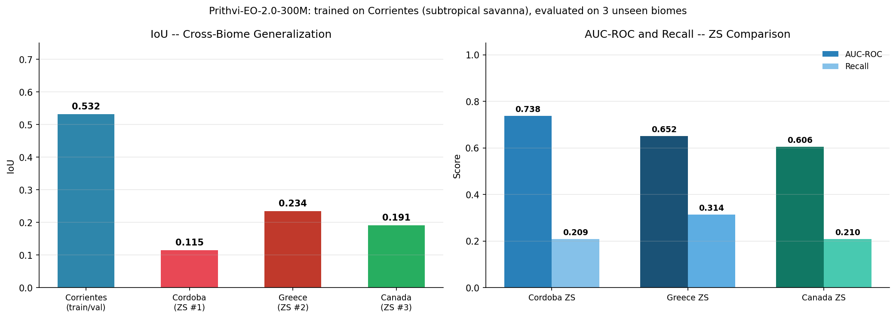
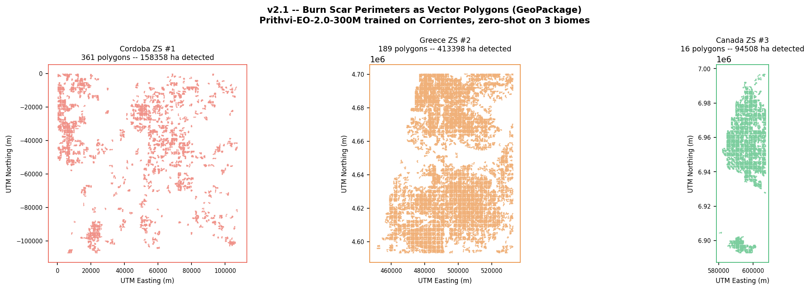
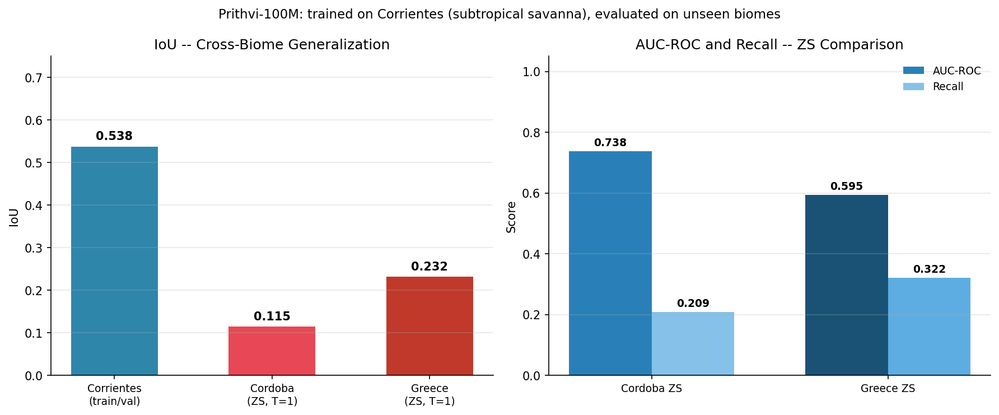
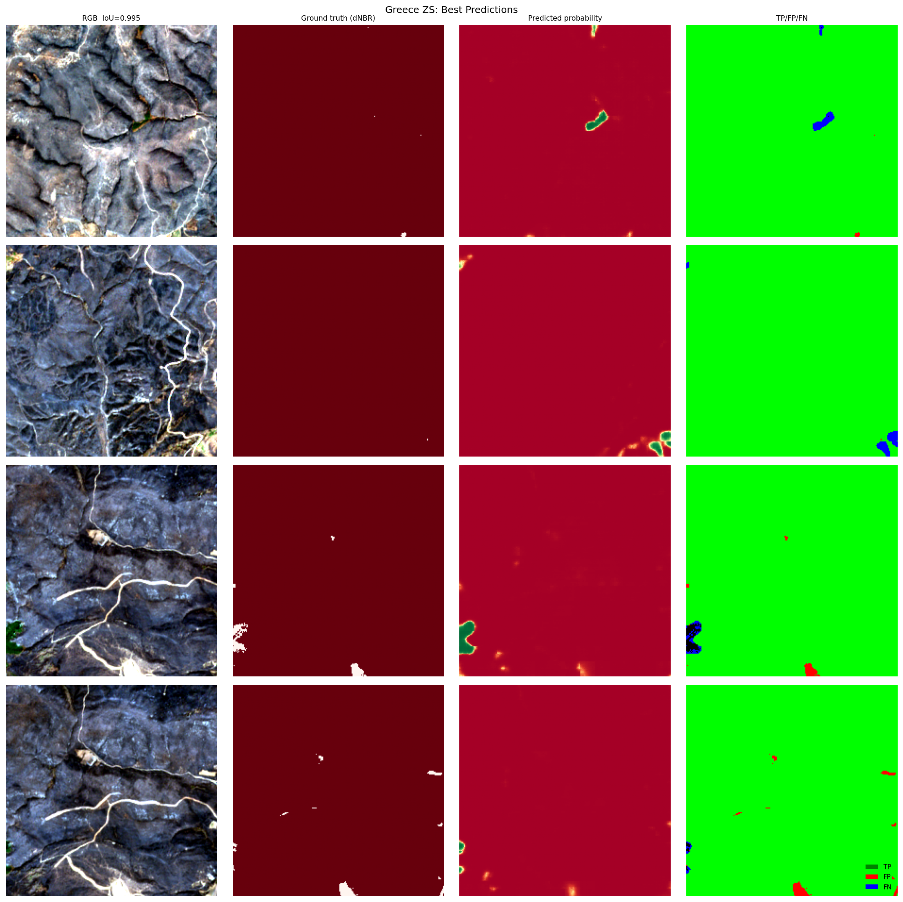
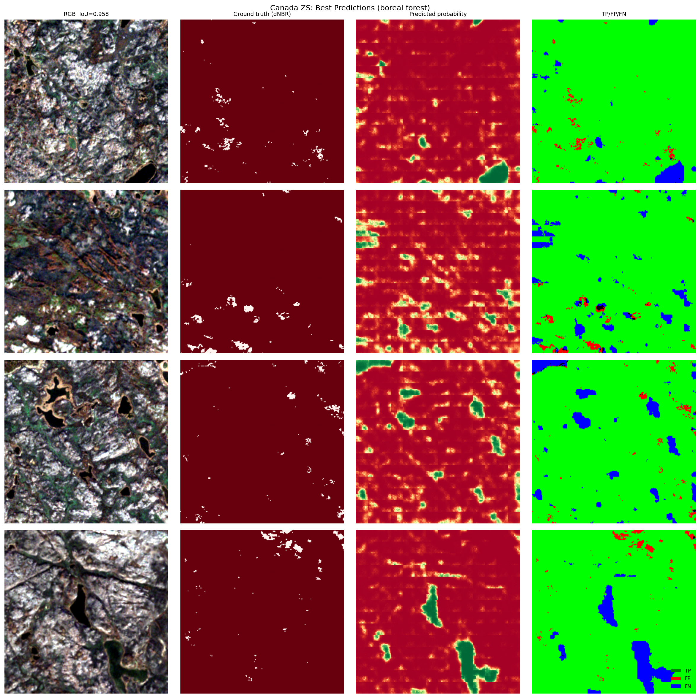
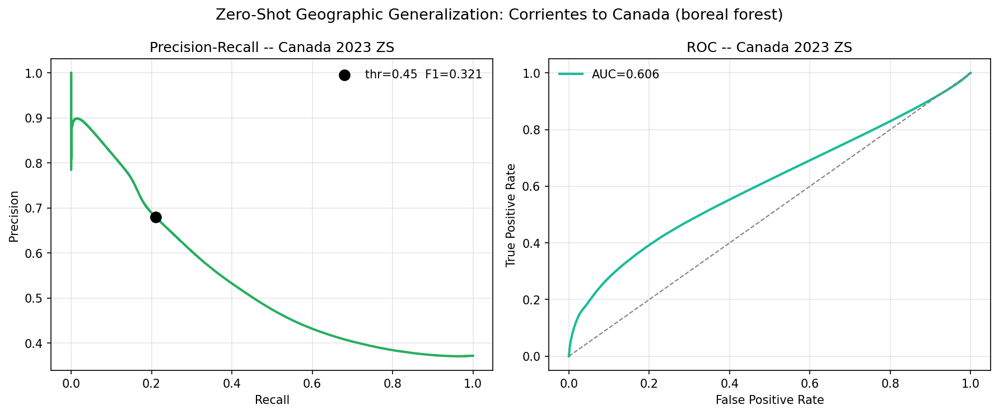
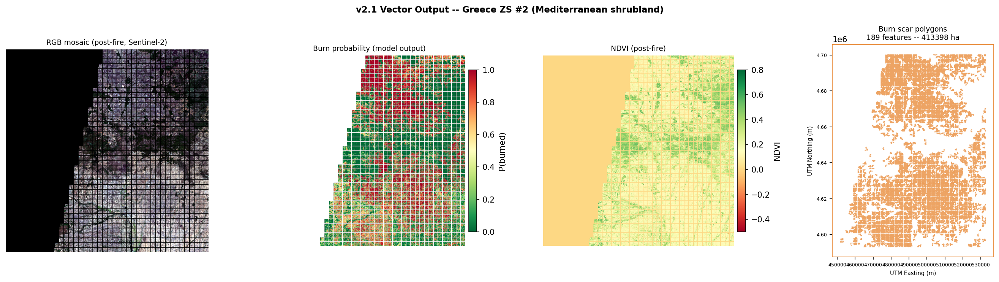

# Changelog and Detailed Results

Full experimental history, per-version metrics, and figures for the wildfire burn scar detection project. For the current model, live demo, and headline results, see [README.md](README.md).

**Two numbering tracks.** The tags below (v1.0, v1.1, ..., v2.3, ...) are internal engineering
milestones, tagged and pushed individually so the iteration process stays inspectable. The
README and the live dashboard instead refer to public release names (v1, v2, ...), each one
bundling a cluster of internal tags that together represent a real capability jump worth
announcing. The current public release is **v2**, built from internal tags v2.0 through v2.3.

---

## Version summary

| Version | Change | Val IoU | Notes |
|---|---|---|---|
| v1.0 | Base model, FIRMS labels, threshold=0.50 | 0.013 | Prithvi-EO-1.0-100M + FPN |
| v1.1 | Switch to dNBR labels (threshold=0.10) | 0.42 | 21x more positive patches. 49x IoU improvement vs v1.0 |
| v1.2 | Optimal threshold t=0.65, continuation training | 0.45 | Post-processing only for threshold. Epoch 73 best checkpoint |
| v1.3 | Partial backbone unfreeze (last 2 transformer blocks) | 0.50 | Differential LR (1e-5 backbone, 5e-5 decoder) |
| v1.4 | Spectral variation training (contrast, brightness, noise) | 0.36 | Too aggressive late in training. v1.3 checkpoint preserved |
| v1.5 | Multi-scale FPN neck (layers 2, 5, 8, 11) | 0.538 | 45 epochs. IoU +8.9% vs v1.3. ZS Cordoba: IoU=0.115, AUC-ROC=0.738 |
| v1.6 | Siamese T=2 temporal fusion (pre + post fire) | 0.639 | TemporalFusionNeck. IoU +18.6% vs v1.5. FT Cordoba T=2: IoU=0.810 |
| v1.7 | Cordoba geographic evaluation (ZS and few-shot FT, T=1 and T=2) | 0.538 | ZS: IoU=0.115 (T=1), 0.087 (T=2). FT: IoU=0.329 (T=1), 0.810 (T=2 within-region) |
| v1.8 | Cross-continental ZS evaluation on Greece 2023 (Alexandroupolis, Mediterranean) | 0.538 | ZS Greece: IoU=0.232, AUC-ROC=0.595. No Greek labels. 10,119 patches |
| v2.0 | Backbone upgrade to Prithvi-EO-2.0-300M (307M params, embed_dim=1024, depth=24) | 0.532 | New ZS site: Canada NWT 2023 (boreal forest, 163,000 ha). AUC-ROC > 0.5 confirmed in 3 biomes. MC Dropout operational decision support |
| v2.1 | Vector output: burn scar perimeters as GeoPackage (GPKG) for 3 zero-shot sites | 0.532 | NDVI + NBR per scene. RGB mosaics. Georeferenced polygons (UTM) with area, perimeter, model attributes. Boundary uncertainty ~160m |
| v2.2 | Second training biome (Australia); interactive Leaflet dashboard (GitHub Pages); zero-shot showcase on Chile 2023 (Valparaiso) | 0.598 | Threshold-tuned IoU=0.6512, F1=0.7887. 146 polygons, 203,910 ha, mean_prob per polygon, confidence tiering. California/Cerrado planned next |
| v2.3 | ESA WorldCover land cover context per polygon; dashboard UX pass | 0.598 | Same model as v2.2, no retraining. 146 Chile polygons matched against ESA WorldCover 10m (2021) via zonal statistics. Per-zone popups replace the old sidebar detail view; confidence tiers now show recommended action (ready to use / verify / send crew); Burn Probability vs Area switched from buttons to a dropdown |
| v2.4 | Chile dNBR ground truth alignment + real zero-shot metrics | 0.598 | Same model as v2.2, no retraining. Probability raster re-exported from patches and cropped to the exact dNBR grid (same UTM origin, no reprojection needed). Chile: IoU=0.175, Precision=0.218, Recall=0.472, AUC-ROC=0.855 (highest of 4 ZS sites) against dNBR>0.15 on 116,976,640 pixels. Threshold sweep confirmed the gap is not a calibration issue (best possible IoU=0.178, +1.3% over the fixed threshold) -- it's a domain-shift/discrimination issue, pointing at T=3 multi-temporal input as the real fix. `mean_dnbr` added per polygon in the GeoPackage; deliberately held back from the live dashboard until the T=3 update lands, to avoid publishing a confusing model-vs-ground-truth mismatch without the fix already in hand |
| v2.5 | Re-evaluated Cordoba, Greece, and Canada with the v2.2 (post-Australia) checkpoint; per-scene adaptive threshold (Otsu) | 0.598 | Same model as v2.2, no retraining. These 3 sites were only ever evaluated with the pre-Australia checkpoint -- this closes that gap. Result: Greece improved (IoU 0.234 to 0.245 fixed, 0.257 with Otsu; AUC-ROC 0.652 to 0.668), Cordoba regressed (IoU 0.115 to 0.105; AUC-ROC 0.738 to 0.666), Canada's naive "best threshold" result (IoU=0.3855 at t=0.00) was found to be a measurement artifact -- mathematically identical to the site's ground-truth positive rate (0.385), meaning it reflects predicting every pixel as burned, not real discrimination. Real Canada number at its operating threshold: IoU=0.289, still below the 0.385 trivial baseline. Otsu (unsupervised, no labels) threshold recovers part of Greece's and Canada's calibration gap and, unlike the labeled sweep, never selects a degenerate all-positive threshold |

---

## Metrics by version and site

| Version | Model | Region | Biome | IoU | Recall | Precision | AUC-ROC |
|---|---|---|---|---|---|---|---|
| v1.0 | U-Net ResNet34 + FIRMS labels | Corrientes | Subtropical savanna | 0.013 | 7% | 14% | - |
| v1.5 | Prithvi-EO-1.0-100M + FPN | Corrientes val | Subtropical savanna | 0.538 | 71% | 69% | - |
| v1.6 | Prithvi-EO-1.0-100M + FPN (T=2) | Corrientes val | Subtropical savanna | **0.639** | **81%** | **75%** | - |
| v1.5 | Prithvi-EO-1.0-100M + FPN (ZS) | Cordoba | Argentine Monte | 0.115 | 21% | 20% | 0.738 |
| v1.5 | Prithvi-EO-1.0-100M + FPN (ZS) | Greece | Mediterranean | 0.232 | 32% | 45% | 0.595 |
| v2.0 | Prithvi-EO-2.0-300M + FPN (ZS) | Cordoba | Argentine Monte | 0.115 | 21% | - | 0.738 |
| v2.0 | Prithvi-EO-2.0-300M + FPN (ZS) | Greece | Mediterranean shrubland | 0.234 | 31% | 0.481 | 0.652 |
| v2.0 | Prithvi-EO-2.0-300M + FPN (ZS) | Canada NWT | Boreal forest | 0.191 | 21% | 0.680 | 0.606 |
| v2.2 | Prithvi-EO-2.0-300M + FPN (ZS) | Chile | Mediterranean WUI | 0.175 | 47% | 0.218 | **0.855** |
| v2.2 (post-Australia) | Prithvi-EO-2.0-300M + FPN (ZS) | Cordoba | Argentine Monte | 0.105 (regression) | 59% | 0.113 | 0.666 (down from 0.738) |
| v2.2 (post-Australia) | Prithvi-EO-2.0-300M + FPN (ZS) | Greece | Mediterranean shrubland | 0.245 | 34% | 0.464 | 0.668 |
| v2.2 (post-Australia) | Prithvi-EO-2.0-300M + FPN (ZS) | Canada NWT | Boreal forest | 0.289 | 34% | 0.655 | 0.646 |

49x improvement over the FIRMS-based baseline. The v2.0 backbone (307M parameters) achieves competitive zero-shot IoU across 3 biomes never seen during training. Precision of 0.680 on Canada confirms the model is conservative and reliable when it fires, even in a completely unseen biome. Chile's AUC-ROC of 0.855 is the highest of the four zero-shot sites -- the model ranks burned vs. unburned pixels well even where the fixed decision threshold (calibrated on Corrientes + Australia) is not precision-optimal for the new biome. The post-Australia re-evaluation of Cordoba, Greece, and Canada (v2.5, see below) shows the second training biome did not uniformly improve zero-shot transfer: Greece gained, Cordoba regressed. Full breakdown, including a caught measurement artifact in the Canada numbers, is in the dedicated section below.

---

## v2.0 Highlights

- Backbone upgraded from Prithvi-EO-1.0-100M to Prithvi-EO-2.0-300M (307M parameters, 3x larger)
- New zero-shot site: North Slave Complex, Northwest Territories, Canada (boreal forest, August 2023, forced evacuation of Yellowknife with 20,000 residents)
- AUC-ROC above 0.5 confirmed in all 3 zero-shot biomes: the model ranks burned vs. unburned pixels above chance everywhere
- Operational decision support: MC Dropout uncertainty maps classify patches as DEPLOY / VERIFY / MONITOR
- Cross-biome evaluation now spans 3 continents, 4 biomes, and 0 target-domain annotations

*Left: IoU across all 4 evaluation sites. Right: AUC-ROC and Recall comparison across the 3 zero-shot sites.*

---

## v2.1 Highlights

- Burn scar segmentation masks converted to GeoPackage (GPKG) vector polygons for direct GIS integration
- Per-scene NDVI and NBR spectral indices computed from Sentinel-2 L2A surface reflectance
- Full-scene RGB mosaics reconstructed from non-overlapping patches across all three zero-shot sites
- Greece and Canada outputs correctly georeferenced in UTM; outputs carry model attribution attributes (`area_ha`, `perimeter_km`, `site`, `date`, `model`)

*Predicted burn scar perimeters as vector polygons (GeoPackage) for three zero-shot sites. Detected areas are model predictions at zero-shot: precision ranges from 20% (Cordoba, Argentine Monte) to 68% (Canada, boreal forest). Approximate perimeters with boundary uncertainty of ~160m due to non-overlapping patch extraction.*

---

## Model architecture: v1.x (Prithvi-EO-1.0-100M)

| Component | Details |
|---|---|
| Backbone | Prithvi-EO-1.0-100M (IBM/NASA), embed_dim=768, depth=12 |
| Pretraining | Masked autoencoding on HLS (Harmonized Landsat-Sentinel) |
| Neck (v1.5) | Multi-scale FPN neck (layers 2, 5, 8, 11 to 256-ch feature map) |
| Neck (v1.6) | TemporalFusionNeck: concat(pre, post) per layer, 1x1 Conv, top-down FPN |
| Decoder | Feature Pyramid Network (FPN), trained from scratch |
| Input bands | B02, B03, B04, B8A, B11, B12 at 10m resolution |
| Temporal input | T=1 (post-fire only) through v1.5; T=2 (pre + post) from v1.6 |
| Patch size | 224x224 px |
| Loss | DiceLoss + FocalLoss, fire class weight = 5.0 |

Current architecture (v2.0-v2.2, Prithvi-EO-2.0-300M) is documented in the main [README.md](README.md#approach).

---

## Dataset: earlier zero-shot sites (v1.x-v2.1)

### Zero-shot test 1: Cordoba, Argentina

| | |
|---|---|
| Region | Cordoba Province, central Argentina (Sierras Chicas, xerophytic scrubland) |
| Coordinates | 65.5W-62.5W / 33.0S-30.5S |
| Fire event | October-November 2020 |
| Biome | Argentine Monte (highland xerophytic scrubland) |
| Patches | 6,634 x 224x224 px |
| Positive rate | 63.7% (dNBR > 0.10) |
| Labels used in training | None |

### Zero-shot test 2: Alexandroupolis, Greece

| | |
|---|---|
| Region | Evros / Dadia-Lefkimi-Soufli, NE Greece |
| Coordinates | 25.6E-27.4E / 40.6N-42.0N |
| Fire event | August 2023 (largest EU wildfire on record, ~81,000 ha) |
| Biome | Mediterranean shrubland |
| Scenes | 18 pre-fire + 18 post-fire Sentinel-2 L2A tiles |
| Patches | 10,119 x 224x224 px |
| Positive rate | 76.9% (dNBR > 0.10) |
| Labels used in training | None |

### Zero-shot test 3: North Slave Complex, Canada (v2.0)

| | |
|---|---|
| Region | Northwest Territories, Canada (NWT) |
| Coordinates | 116.5W-113.5W / 61.8N-63.2N |
| Fire event | August 2023 (forced evacuation of Yellowknife, ~163,000 ha) |
| Biome | Boreal forest (completely distinct from subtropical savanna and Mediterranean shrubland) |
| Pre-fire scenes | June-July 2023 |
| Post-fire scenes | September-October 2023 |
| Raw downloads | 288 JP2 files |
| Patches | 9,064 x 224x224 px (filtered: MIN_VALID_FRAC=0.70, MAX_WATER_FRAC=0.30) |
| Labels used in training | None |

---

## Detailed results

### Corrientes validation

*Best, median, and worst-performing patches from the Corrientes validation set. Error maps: green = true positive, orange = false positive, red = false negative. Right panel: full model progression v1.0 to v1.6 and best-model metrics (v1.6 T=2: IoU=0.64, F1=0.78).*

### Threshold optimization (v1.1)

Sweeping thresholds 0.05 to 0.95 on the validation set reveals the optimal operating point is t=0.65 for v1.x (t=0.450 for v2.0+). At t=0.65, precision improves from 0.50 to 0.57 by reducing false positives while IoU and F1 also improve. The PR curve shows strong discriminative ability: the gain comes from choosing a better decision boundary, not retraining.

### Temporal fusion: Siamese T=2 model (v1.6)

Adding a pre-fire image (Oct-Nov 2021) as a second temporal input gives the model direct access to spectral change rather than post-fire reflectance alone. The Siamese backbone processes pre-fire and post-fire images in parallel; the TemporalFusionNeck concatenates features at transformer layers 2, 5, 8, 11 and fuses them before the FPN decoder.

| Metric | v1.5 (T=1, post-fire only) | v1.6 (T=2, pre + post) | Delta |
|---|---|---|---|
| IoU | 0.538 | **0.639** | +0.101 (+18.6%) |
| F1 | 0.700 | **0.780** | +0.080 |
| Precision | 0.693 | **0.753** | +0.060 |
| Recall | 0.707 | **0.808** | +0.101 |

Both precision and recall improve simultaneously: the model eliminates false positives in areas with burn-scar-like reflectance that showed no spectral change between dates (bare soil, dry grassland).

### Zero-shot test 1: Cordoba, Argentina

| Metric | Corrientes val (v1.5) | Cordoba zero-shot (v1.5) |
|---|---|---|
| IoU | 0.538 | 0.115 |
| Recall | 0.71 | 0.21 |
| Precision | 0.69 | 0.20 |
| AUC-ROC | - | 0.738 |

Zero-shot transfer to Cordoba yields IoU=0.115 and AUC-ROC=0.738. AUC-ROC=0.738 confirms the model retains transferable burn-scar features, motivating few-shot fine-tuning.

### Few-shot domain adaptation: Cordoba

The FPN decoder was fine-tuned on 100 Cordoba patches (encoder kept frozen). The remaining 6,534 patches were held out as the test set.

| Metric | Zero-shot (v1.5) | Few-shot FT (100 patches) | Change |
|---|---|---|---|
| IoU | 0.115 | **0.329** | +0.214 (+186%) |
| Recall | 0.21 | **0.54** | +0.33 |
| Precision | 0.20 | **0.46** | +0.26 |
| AUC-ROC | 0.738 | **0.870** | +0.132 |

Fine-tuning the FPN decoder on 100 Cordoba patches yields a 2.9x IoU gain. All adaptation comes from the decoder adjusting to the new biome spectral distribution; the backbone encoder weights are never updated.

### Zero-shot test 2: Greece 2023

| Metric | Corrientes val | Cordoba ZS | Greece ZS |
|---|---|---|---|
| IoU | 0.538 | 0.115 | **0.232** |
| Recall | 0.71 | 0.21 | 0.32 |
| Precision | 0.69 | 0.20 | 0.45 |
| AUC-ROC | - | 0.738 | 0.595 |

Zero-shot IoU on Greece (0.232) exceeds Cordoba (0.115), reflecting the unambiguous spectral signature of the large Dadia burn scar. Precision reaches 0.453 zero-shot, indicating the model correctly localises burned pixels when it fires.

### Zero-shot test 3: Canada NWT 2023 (v2.0)

The v2.0 model (Prithvi-EO-2.0-300M backbone) was applied zero-shot to the North Slave Complex wildfire in Northwest Territories, Canada (August 2023). This fire forced the evacuation of Yellowknife (20,000 residents) and burned approximately 163,000 ha of boreal forest, a biome spectrally completely distinct from the subtropical savanna used for training.

| Metric | Corrientes val (v2.0) | Cordoba ZS (v2.0) | Greece ZS (v2.0) | Canada ZS (v2.0) |
|---|---|---|---|---|
| IoU | 0.532 | 0.115 | 0.234 | **0.191** |
| Recall | - | 0.209 | 0.314 | 0.210 |
| Precision | - | - | 0.481 | **0.680** |
| AUC-ROC | - | 0.738 | 0.652 | 0.606 |

AUC-ROC exceeds 0.5 in all 3 zero-shot biomes. Precision of 0.680 on Canada is the highest across all ZS sites: when the model predicts a burn scar in boreal forest, it is right 68% of the time despite never having seen this biome. AUC-ROC decreases monotonically with biome distance from the training site (0.738 same-continent, 0.652 cross-continental Mediterranean, 0.606 boreal), a pattern consistent with foundation model geographic generalization.

### Operational decision support (v2.0)

MC Dropout (forward hooks on FPN decoder GELU layers, p=0.08, N=30 passes) generates per-patch uncertainty estimates. Patches are classified into three operational categories based on mean burn probability:

| Category | Threshold | Action |
|---|---|---|
| DEPLOY | P > 0.65 | High confidence -- dispatch field team |
| VERIFY | 0.40 < P <= 0.65 | Medium confidence -- aerial check first |
| MONITOR | 0.20 < P <= 0.40 | Low confidence -- satellite follow-up |

*Operational decision support on Canada ZS patches. Each row shows RGB, burn probability map, and dNBR ground truth for representative DEPLOY, VERIFY, and MONITOR patches.*

### Vector output: burn scar perimeters (v2.1)

*Greece ZS: RGB mosaic (post-fire Sentinel-2), burn probability map, NDVI, and vector polygon perimeters in UTM zone 35N. Strong red probability patches correspond to the Dadia forest burn scar (Evros, August 2023).*

| Site | Polygons | Detected area | Reference area | Note |
|---|---|---|---|---|
| Cordoba ZS | 361 | 158,358 ha | ~28,000 ha | Zero-shot, Argentine Monte -- high false positive rate |
| Greece ZS | 189 | 413,398 ha | ~81,000 ha | Zero-shot, Mediterranean shrubland -- correctly georeferenced (UTM 35N) |
| Canada ZS | 16 | 94,508 ha | ~163,000 ha | Single tile, boreal forest -- correctly georeferenced (UTM 11N) |

Detected areas reflect zero-shot precision, not validated measurements. Recall at zero-shot ranges from 21% (Cordoba, Canada) to 31% (Greece), consistent with the patch-level metrics above. GeoPackage attributes: `area_ha`, `perimeter_km`, `site`, `date`, `model`.

### Re-evaluation with the v2.2 (post-Australia) checkpoint (v2.5)

Cordoba, Greece, and Canada were evaluated once, with the checkpoint that existed before Australia was added as a second training biome. Every subsequent Roadmap and README revision continued to cite those pre-Australia numbers next to a claim that the second biome would add "+10-20 IoU ZS" -- that claim was never actually checked against these three sites. This section re-runs all three with the current (post-Australia) checkpoint, at both the fixed threshold (0.450, for direct comparison to the old numbers) and via a full per-site threshold sweep (0.00 to 1.00, 51 steps), plus an unsupervised per-scene threshold (Otsu) computed from the predicted-probability distribution alone, without using any ground truth.

| Site | Pre-Australia IoU | Post-Australia IoU (fixed t=0.45) | Post-Australia IoU (best, labeled sweep) | Post-Australia IoU (Otsu, unsupervised) | Pre-Australia AUC-ROC | Post-Australia AUC-ROC | GT positive rate |
|---|---|---|---|---|---|---|---|
| Cordoba | 0.115 | 0.105 | 0.105 (t=0.44, no gain) | 0.104 (t=0.46) | 0.738 | 0.666 | 7.2% |
| Greece | 0.234 | 0.245 | 0.272 (t=0.14) | 0.257 (t=0.38) | 0.652 | 0.668 | 23.3% |
| Canada | 0.191 | 0.289 | 0.385 (t=0.00) | 0.295 (t=0.42) | 0.606 | 0.646 | 38.5% |

**Cordoba regressed.** Both IoU and AUC-ROC dropped after adding Australia, and no threshold (labeled or unsupervised) recovers the loss. This is a genuine, non-trivial finding: the second training biome hurt zero-shot transfer to this particular site.

**Greece improved, and the improvement is real.** IoU rose under the fixed threshold and rose further under both the labeled sweep and the unsupervised Otsu threshold, comfortably above the site's ground-truth positive rate (23.3%) in all cases -- consistent with genuine discrimination, not a threshold artifact.

**Canada's "best" result is a measurement artifact, not a model improvement.** The labeled sweep selected t=0.00 -- classify every pixel as burned -- as optimal, with IoU=0.3855. Checked against the site's ground-truth positive rate (0.3855, to four decimal places): this is not a coincidence. When every pixel is predicted positive, IoU reduces algebraically to the fraction of pixels that are actually positive, independent of any real model skill. This number was caught before it reached the README and discarded. At the model's real operating threshold (fixed, 0.450), Canada's IoU is 0.289 -- an improvement over the pre-Australia number (0.191), but still *below* the 0.385 trivial all-positive baseline, meaning the model's actual operating point in Canada underperforms a classifier that ignores the image entirely. The only legitimate signal of improvement in Canada is the AUC-ROC increase (0.606 to 0.646), a modest gain in ranking ability that does not (yet) translate into a good absolute operating point.

**Per-scene Otsu threshold (unsupervised) is a viable production-style calibration.** Instead of a single global threshold across all biomes, Otsu's method picks a per-scene threshold from the bimodality of the predicted-probability histogram alone -- no ground truth required, which is the realistic condition for a genuinely new deployment region. It recovers roughly half of Greece's calibration gap, gives Canada a small but non-degenerate improvement (crucially, it never selects the trivial t=0.00 solution the labeled search fell into), and correctly finds no gain available for Cordoba. This is now the recommended operating threshold strategy over the single fixed 0.450 value used through v2.4.

**Conclusion: one additional training biome is not a reliable lever for zero-shot generalization.** The evidence across four zero-shot sites (Chile, Cordoba, Greece, Canada) does not support "add more training biomes" as a path to better cross-domain transfer -- the effect is heterogeneous, and in one case actively negative. Combined with the precedent that T=2 temporal fusion also hurt Cordoba's zero-shot transfer in v1.7 (while helping in-domain and fine-tuned scenarios), a multi-temporal T=3 retrain is not the obvious next step it once appeared to be. The more likely root causes, targeted by the v3 redesign proposed in the README Roadmap, are the fixed-threshold dNBR label definition (not comparable across vegetation types) and the absolute-reflectance input representation (rather than a relative/change-based one) -- neither of which "more data" addresses directly.

RBR (Relativized Burn Ratio, Parks et al. 2014) was considered as an immediate fix for the label-definition half of this problem, since it is designed to be more comparable across vegetation types than a fixed dNBR threshold. It was not applied in this round: patch extraction for Cordoba, Greece, and Canada retained only the already-thresholded binary burn mask, not the continuous dNBR or pre-fire NBR values RBR requires. Recomputing it needs the original Sentinel-2 scenes reprocessed for all three sites, which is deferred to the v3 redesign rather than attempted as a quick fix here.
