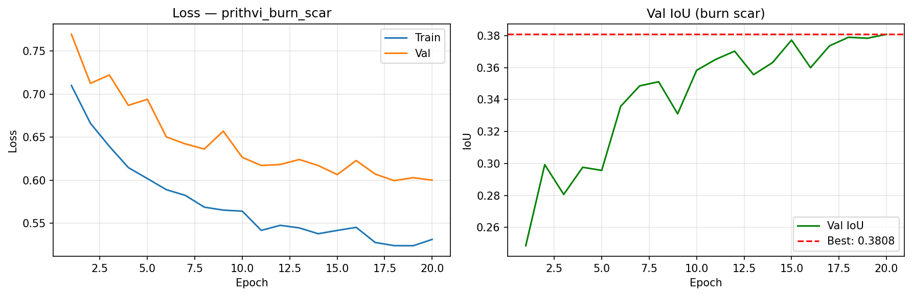
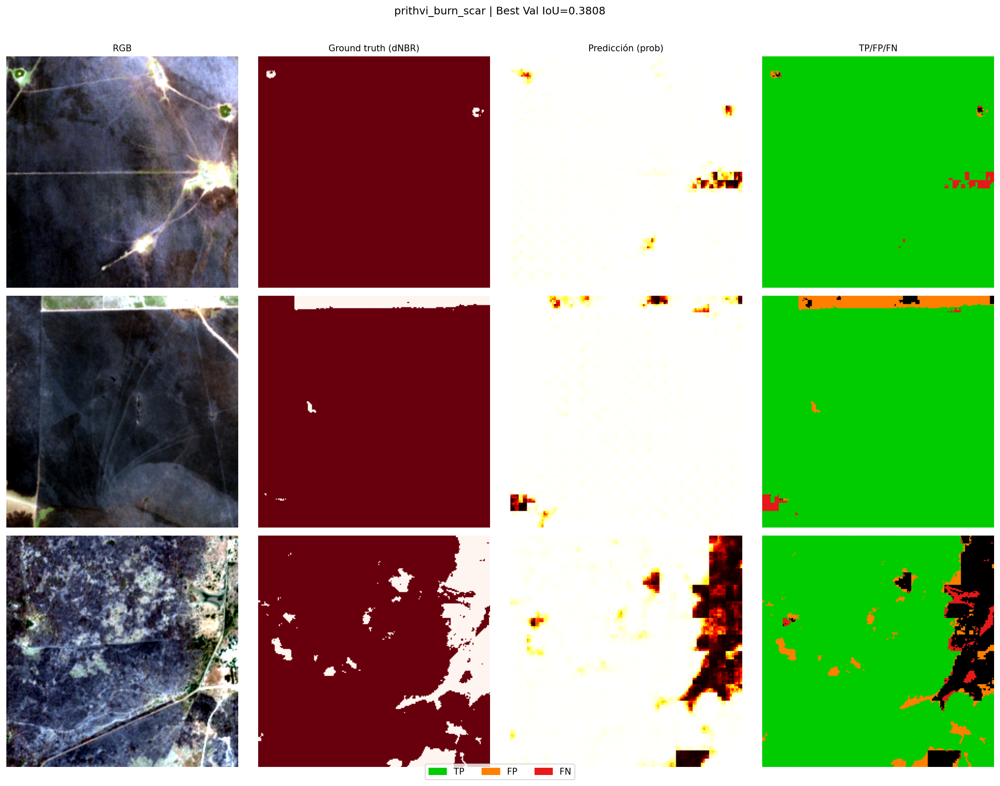
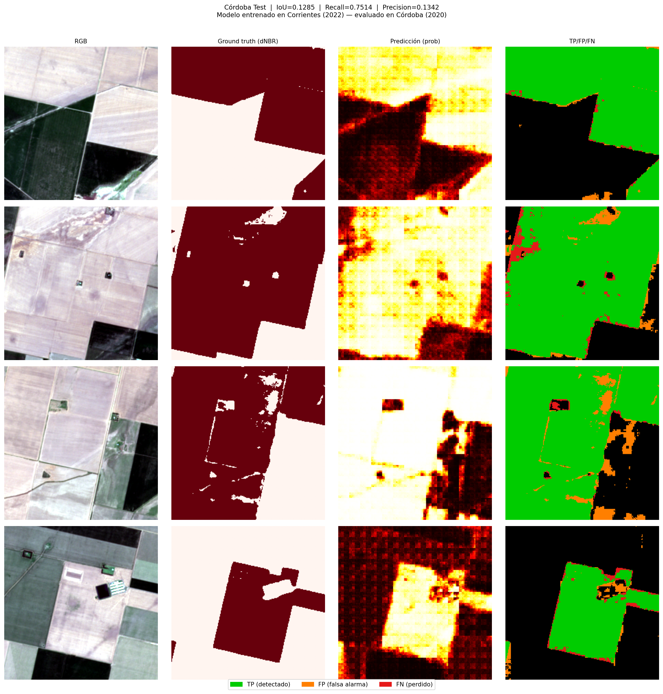

# Wildfire Burn Scar Detection with Prithvi-100M and Sentinel-2

Semantic segmentation of wildfire burn scars using the IBM/NASA Prithvi-100M geospatial foundation model fine-tuned on Sentinel-2 L2A imagery. Trained on the 2021-2022 Corrientes, Argentina fire season and evaluated for geographic generalization on an unseen region (Cordoba, 2020).

## Key Results

| Model | Labels | Pixel IoU | Recall |
|---|---|---|---|
| U-Net ResNet34 | FIRMS active fire | 0.013 | 7% |
| **Prithvi-100M + FPN** | **dNBR burn scar** | **0.42** | **73%** |
| Prithvi-100M + FPN | dNBR, Cordoba (unseen) | 0.13 | **75%** |

32x improvement over the FIRMS-based baseline. The Cordoba test demonstrates cross-region, cross-year transfer with high recall (75% of real burn scars detected).

## Approach

### The label problem

Initial training used NASA FIRMS active fire detections as ground truth. Only 2.6% of patches contained fire pixels, producing a pixel-level IoU of 0.013. The validation metric appeared higher (0.50) because empty patches scored 1.0 trivially, inflating the per-batch average.

FIRMS detects active fire (thermal anomaly), not burn scars. A pixel that burned three days ago leaves no thermal signal but remains a burned area. The correct label source is dNBR (differenced Normalized Burn Ratio), computed from pre- and post-fire Sentinel-2 imagery.

```
dNBR = NBR_pre - NBR_post     where NBR = (B8A - B12) / (B8A + B12)
Burn scar threshold: dNBR > 0.10
```

This change increased positive patch coverage from 2.6% to 55.8% (21x more training signal) and enabled meaningful learning.

### Model architecture

| Component | Details |
|---|---|
| Backbone | Prithvi-EO-1.0-100M (IBM/NASA) |
| Pretraining | Masked autoencoding on HLS (Harmonized Landsat-Sentinel) |
| Decoder | Feature Pyramid Network (FPN), trained from scratch |
| Encoder | Frozen during fine-tuning (100M parameters) |
| Input bands | B02, B03, B04, B8A, B11, B12 at 10 m resolution |
| Patch size | 224x224 px |
| Loss | DiceLoss + FocalLoss, fire class weight = 5.0 |

## Dataset

### Training: Corrientes, Argentina

| | |
|---|---|
| Region | Corrientes Province, NE Argentina (wetlands and grasslands) |
| Coordinates | 59.5W-56.0W / 29.0S-26.5N |
| Fire event | December 2021 - February 2022 (austral summer, extreme drought) |
| Scenes | 6 Sentinel-2 L2A tiles, 0% cloud cover |
| Patches | 5,687 x 224x224 px |
| Positive rate | 55.8% (dNBR > 0.10) |
| Source | Copernicus Data Space Ecosystem (CDSE) |

### Test: Cordoba, Argentina (unseen region)

| | |
|---|---|
| Region | Cordoba Province, central Argentina (Sierras Chicas, xerophytic scrubland) |
| Coordinates | 65.5W-62.5W / 33.0S-30.5N |
| Fire event | October-November 2020 |
| Patches | 6,634 x 224x224 px |
| Positive rate | 63.7% (dNBR > 0.10) |

The Cordoba set is a strict generalization test: different region, different biome, different year.

## Results

### Training curves



### Sample predictions, Corrientes validation set



### dNBR labels versus FIRMS detections


Left: FIRMS active fire detections (sparse, misses most burned area). Right: dNBR-derived burn scar mask (complete, spatially consistent).

### Geographic generalization: Cordoba



| Metric | Corrientes (val) | Cordoba (test) |
|---|---|---|
| IoU | 0.42 | 0.13 |
| Recall | 0.73 | **0.75** |
| Precision | 0.50 | 0.13 |
| AUC-ROC | - | 0.73 |

The model retains high recall in Cordoba (75% of real burn scars detected) but precision drops due to spectral distribution shift between the Corrientes wetlands biome and the Cordoba mountain scrubland. AUC-ROC of 0.73 confirms the model learned real burn-scar spectral features rather than region-specific patterns.

## Limitations and Ongoing Improvements

The main limitation is biome-induced domain shift. The FPN decoder was trained on a single biome (Corrientes grasslands and wetlands) and did not encounter the spectral characteristics of mountain xerophytic vegetation. This causes over-prediction (low precision) in Cordoba while detection sensitivity (recall) is preserved.

Ongoing improvements:

- **Multi-region training:** include Cordoba and a third biome in the training split
- **Spectral augmentation:** random per-band scaling during training to reduce spectral memorization
- **Few-shot domain adaptation:** fine-tune the decoder on 50-100 Cordoba samples to bridge the domain gap with minimal annotation effort

## Repository Structure

```
wildfire-burn-scar/
├── notebooks/
│   ├── 01_download_sentinel2.ipynb      Sentinel-2 L2A via CDSE STAC
│   ├── 02_download_firms.ipynb          NASA FIRMS VIIRS active fire
│   ├── 03_download_era5.ipynb           ERA5 wind and temperature (ECMWF CDS)
│   ├── 04_preprocess.ipynb              Band stacking, patch extraction
│   ├── 04b_dnbr_labels.ipynb            dNBR computation and burn scar masks
│   ├── 05_train_baseline.ipynb          U-Net ResNet34 with FIRMS labels
│   ├── 06_evaluate_baseline.ipynb       Diagnostic: why FIRMS IoU = 0.013
│   ├── 07_prithvi.ipynb                 Prithvi-100M fine-tuning (Colab)
│   ├── 08_download_cordoba.ipynb        Cordoba test set generation
│   └── 09_evaluate_cordoba.ipynb        Geographic generalization test (Colab)
├── results/
│   ├── training_curves_prithvi_burn_scar.png
│   ├── predictions_prithvi_burn_scar.png
│   ├── dnbr_distribution.png
│   ├── dnbr_vs_firms_comparison.png
│   ├── cordoba_predictions.png
│   └── cordoba_evaluation_curves.png
├── environment.yml
└── .gitignore
```

## Reproduce

**Environment**

```bash
conda env create -f environment.yml
conda activate geoai-wildfire
```

**Credentials**

Copy `.env.example` to `.env` and fill in your credentials:

```
CDSE_USER=your_copernicus_user
CDSE_PASSWORD=your_copernicus_password
FIRMS_API_KEY=your_firms_key
CDS_URL=https://cds.climate.copernicus.eu/api
CDS_KEY=your_cds_key
```

- CDSE: free account at [dataspace.copernicus.eu](https://dataspace.copernicus.eu)
- FIRMS: free API key at [firms.modaps.eosdis.nasa.gov](https://firms.modaps.eosdis.nasa.gov/api/area/)
- CDS: free account at [cds.climate.copernicus.eu](https://cds.climate.copernicus.eu)

**Run order**

Notebooks 01-06 run locally on CPU (~4-5 hours total, mostly data download).
Notebooks 07 and 09 require a GPU and are designed for Google Colab (A100 recommended).

## Data Sources

| Dataset | Provider | Access |
|---|---|---|
| Sentinel-2 L2A | ESA / Copernicus Data Space | Free, registration required |
| VIIRS SNPP active fire | NASA FIRMS | Free, API key required |
| ERA5 reanalysis | ECMWF / Copernicus CDS | Free, registration required |

## References

- Jakubik, J. et al. (2023). Foundation Models for Generalist Geospatial Artificial Intelligence. arXiv:2310.18660.
- HuggingFace model: [ibm-nasa-geospatial/Prithvi-EO-1.0-100M](https://huggingface.co/ibm-nasa-geospatial/Prithvi-EO-1.0-100M)
- Key, C.H. and Benson, N.C. (2006). Landscape Assessment: Ground measure of severity. USDA Forest Service.
- terratorch: [github.com/IBM/terratorch](https://github.com/IBM/terratorch)
