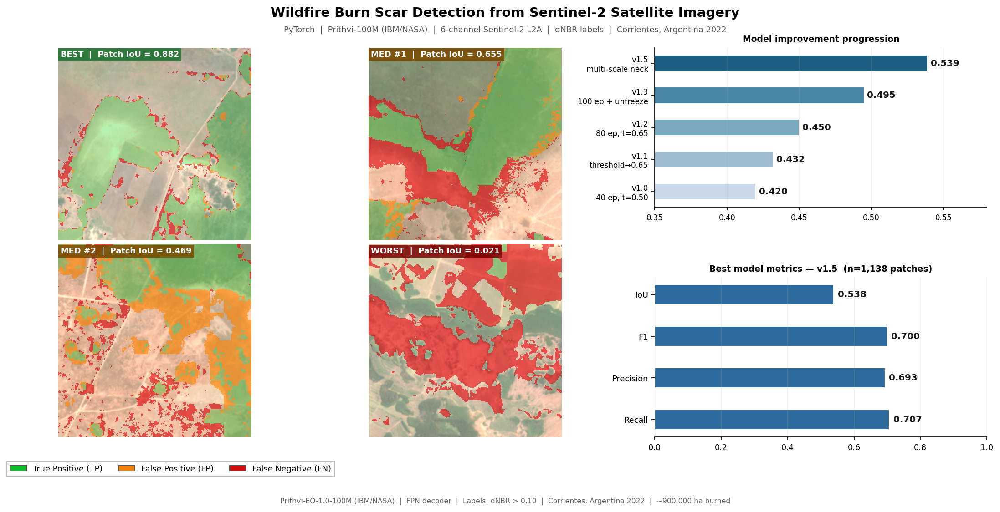
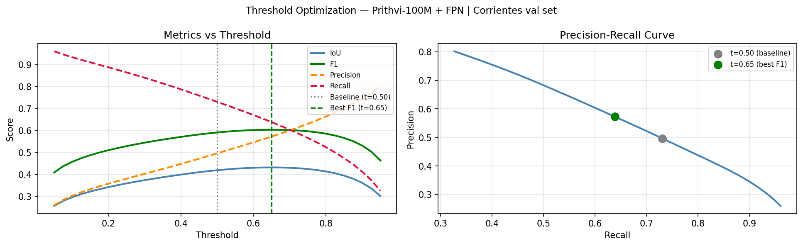
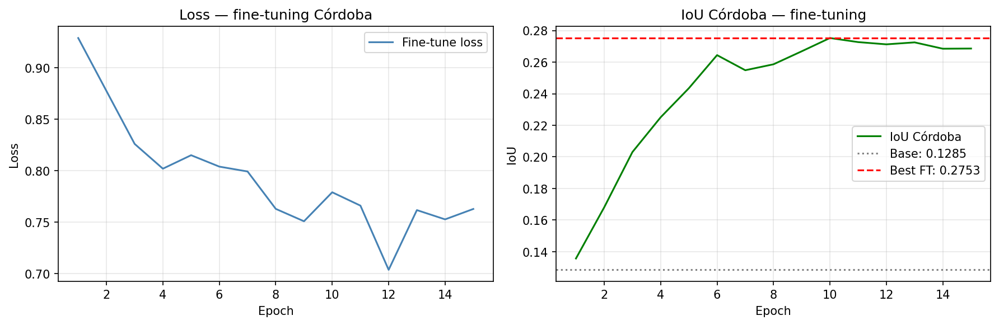
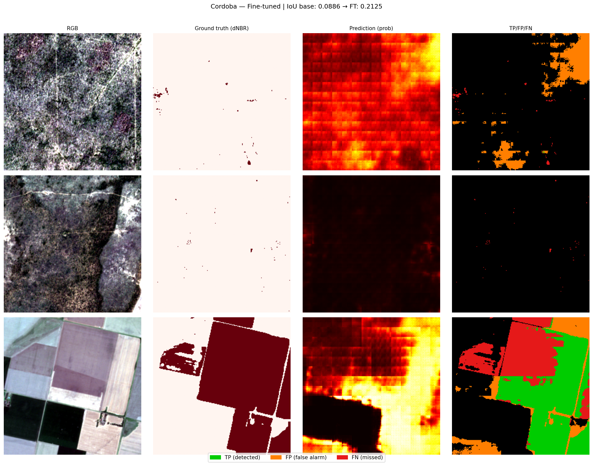
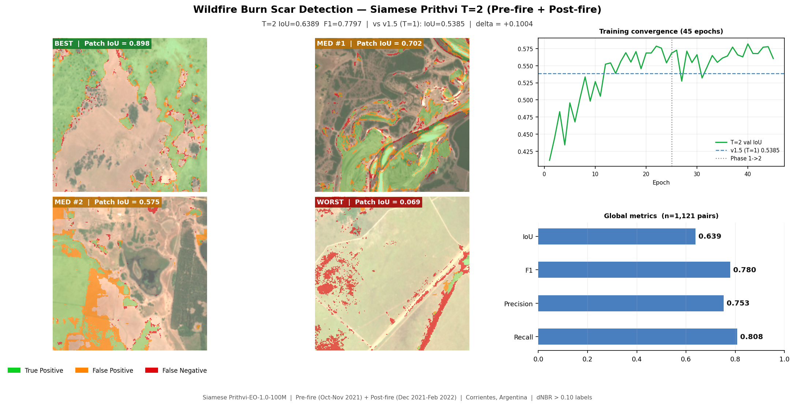

# Wildfire Burn Scar Detection with Prithvi-100M and Sentinel-2

Semantic segmentation of wildfire burn scars using the IBM/NASA Prithvi-100M geospatial foundation model fine-tuned on Sentinel-2 L2A imagery. Trained on the 2021-2022 Corrientes, Argentina fire season (~900,000 ha burned) and evaluated for geographic generalization on an unseen region (Cordoba, 2020).

## Key Results

| Model | Labels | Region | Pixel IoU | Recall | Precision | AUC-ROC |
|---|---|---|---|---|---|---|
| U-Net ResNet34 | FIRMS active fire | Corrientes | 0.013 | 7% | 14% | — |
| Prithvi-100M + FPN (v1.5, T=1) | dNBR burn scar | Corrientes | 0.54 | 71% | 69% | — |
| **Prithvi-100M + FPN (v1.6, T=2)** | **dNBR burn scar** | **Corrientes** | **0.64** | **81%** | **75%** | — |
| Prithvi-100M + FPN | dNBR | Cordoba (zero-shot) | 0.13 | 75% | 13% | 0.73 |
| **Prithvi-100M + FPN (few-shot FT)** | **dNBR** | **Cordoba (100 patches)** | **0.28** | **59%** | **34%** | **0.85** |

49x improvement over the FIRMS-based baseline. Adding a pre-fire temporal input (T=2 Siamese fusion) raises IoU from 0.54 to 0.64 (+18.6%), improving both precision and recall simultaneously. Few-shot fine-tuning of the decoder on 100 Cordoba patches achieves 2.14x IoU gain over zero-shot transfer with the encoder kept frozen throughout.



*Best, median, and worst-performing patches from the Corrientes validation set. Error maps: green = true positive, orange = false positive, red = false negative. Right panel: full model progression v1.0→v1.6 and best-model metrics (v1.6 T=2: IoU=0.64, F1=0.78).*

## Approach

### The label problem

Initial training used NASA FIRMS active fire detections as ground truth. Only 2.6% of patches contained fire pixels, producing a pixel-level IoU of 0.013. The validation metric appeared higher (0.50) because empty patches scored 1.0 trivially, inflating the per-batch average.

FIRMS detects active fire (thermal anomaly), not burn scars. A pixel that burned three days ago leaves no thermal signal but remains a burned area. The correct label source is dNBR (differenced Normalized Burn Ratio), computed from pre- and post-fire Sentinel-2 imagery.

```
dNBR = NBR_pre - NBR_post     where NBR = (B8A - B12) / (B8A + B12)
Burn scar threshold: dNBR > 0.10
```

This change increased positive patch coverage from 2.6% to 55.8% (21x more training signal) and enabled meaningful learning.

### Model architecture

| Component | Details |
|---|---|
| Backbone | Prithvi-EO-1.0-100M (IBM/NASA) — shared weights in Siamese T=2 |
| Pretraining | Masked autoencoding on HLS (Harmonized Landsat-Sentinel) |
| Neck (v1.5) | Multi-scale FPN neck (transformer layers 2, 5, 8, 11 → 256-ch feature map) |
| Neck (v1.6) | TemporalFusionNeck: concat(pre, post) per layer → 1×1 Conv → top-down FPN |
| Decoder | Feature Pyramid Network (FPN), trained from scratch |
| Encoder | Frozen v1.0–v1.2; last 2 transformer blocks unfrozen in v1.3+ |
| Input bands | B02, B03, B04, B8A, B11, B12 at 10 m resolution |
| Temporal input | T=1 (post-fire only) through v1.5 — T=2 (pre + post) from v1.6 |
| Patch size | 224x224 px |
| Loss | DiceLoss + FocalLoss, fire class weight = 5.0 |

## Dataset

### Training: Corrientes, Argentina

| | |
|---|---|
| Region | Corrientes Province, NE Argentina (wetlands and grasslands) |
| Coordinates | 59.5W-56.0W / 29.0S-26.5S |
| Fire event | December 2021 - February 2022 (austral summer, extreme drought) |
| Scenes | 6 Sentinel-2 L2A tiles, 0% cloud cover |
| Patches | 5,687 x 224x224 px |
| Positive rate | 55.8% (dNBR > 0.10) |
| Source | Copernicus Data Space Ecosystem (CDSE) |

### Test: Cordoba, Argentina (unseen region)

| | |
|---|---|
| Region | Cordoba Province, central Argentina (Sierras Chicas, xerophytic scrubland) |
| Coordinates | 65.5W-62.5W / 33.0S-30.5S |
| Fire event | October-November 2020 |
| Patches | 6,634 x 224x224 px |
| Positive rate | 63.7% (dNBR > 0.10) |

The Cordoba set is a strict generalization test: different region, different biome, different year.

## Results

### dNBR labels versus FIRMS detections


Each row shows one patch: RGB image (left), dNBR burn scar mask (center, threshold dNBR > 0.10), and FIRMS active fire mask (right, near-zero). dNBR captures complete burned areas; FIRMS misses them because the thermal anomaly signal disappears days after burning.

### Threshold optimization (v1.1)



Sweeping thresholds 0.05→0.95 on the validation set reveals that the optimal operating point is **t=0.65** (not the default 0.50). At t=0.65, precision improves from 0.50 to 0.57 (+15%) by reducing false positives, while IoU and F1 also improve slightly. The PR curve shows the model has strong discriminative ability — the gain comes from choosing a better decision boundary, not retraining.

### Geographic generalization: Cordoba


| Metric | Corrientes val (v1.5) | Cordoba zero-shot (v1.5) |
|---|---|---|
| IoU | 0.54 | 0.13 |
| Recall | 0.71 | **0.75** |
| Precision | 0.69 | 0.13 |
| AUC-ROC | — | 0.73 |

The model retains high recall in Cordoba (75% of real burn scars detected) but precision drops due to spectral distribution shift between the Corrientes wetlands biome and the Cordoba mountain scrubland. AUC-ROC of 0.73 confirms the model learned transferable burn-scar spectral features.

### Few-shot domain adaptation: Cordoba

The FPN decoder was fine-tuned on 100 Cordoba patches (encoder kept frozen). The remaining 6,534 patches were held out as the test set.





| Metric | Zero-shot (base) | Few-shot FT (100 patches) | Change |
|---|---|---|---|
| IoU | 0.13 | **0.28** | +0.15 |
| Recall | 0.75 | 0.59 | -0.16 |
| Precision | 0.13 | **0.34** | +0.21 |
| AUC-ROC | 0.73 | **0.85** | +0.13 |

The fine-tuning trades some recall for a large precision gain. Overall IoU improves 2.14x. AUC-ROC reaches 0.85, indicating strong discriminative ability after adaptation. The encoder was never updated — all improvement comes from adapting the 2M-parameter decoder to the new biome.

### Temporal fusion: Siamese T=2 model (v1.6)

Adding a pre-fire image (Oct-Nov 2021) as a second temporal input gives the model direct access to spectral change, rather than relying on post-fire reflectance alone. The Siamese backbone (shared weights) processes pre-fire and post-fire images in parallel; the `TemporalFusionNeck` concatenates features at transformer layers 2, 5, 8, 11 and fuses them before the FPN decoder.



| Metric | v1.5 (T=1, post-fire only) | v1.6 (T=2, pre + post) | Δ |
|---|---|---|---|
| IoU | 0.5385 | **0.6389** | +0.1004 (+18.6%) |
| F1 | 0.700 | **0.780** | +0.080 |
| Precision | 0.693 | **0.753** | +0.060 |
| Recall | 0.707 | **0.808** | +0.101 |

Both precision and recall improve simultaneously — the model eliminates false positives in areas with burn-scar-like reflectance that showed no spectral change between dates (bare soil, dry grassland). Optimal threshold shifted from 0.525 to 0.450, indicating the model outputs more calibrated probability estimates when spectral change information is available.

## Limitations

The main limitation is biome-induced domain shift. The FPN decoder was trained on a single biome (Corrientes wetlands) and did not encounter the spectral characteristics of mountain xerophytic vegetation, causing over-prediction in Cordoba (Precision=0.13 zero-shot vs 0.34 after few-shot adaptation). Multi-region training across diverse biomes would reduce this gap without requiring fine-tuning at inference time.

## Roadmap

| Priority | Improvement | Status |
|---|---|---|
| 1 | **T=2 evaluation on Cordoba** — apply v1.6 Siamese model to Cordoba zero-shot; pre-fire spectral change should reduce false positives (Precision 0.13 → est. 0.25+) | Planned |
| 2 | **Test-Time Augmentation (TTA)** — average predictions over flips and rotations at inference, no retraining required | Planned |
| 3 | **Multi-region training (Portugal 2022)** — add ~100k ha from a second fire event to the training set, targeting structural reduction of domain shift without per-region fine-tuning | Planned |

## Changelog

| Version | Change | Val IoU | Val F1 | Notes |
|---|---|---|---|---|
| v1.0 | Base model, threshold=0.50 | 0.42 | 0.591 | Prithvi-100M + FPN, 40 epochs |
| v1.1 | Optimal threshold t=0.65 | 0.43 | 0.604 | Post-processing only, no retraining. Precision +15%, false positives reduced. |
| v1.2 | Continuation training epochs 41-80 | 0.45 | 0.621 | Best checkpoint epoch 73. Precision +18% vs v1.1. |
| v1.3 | Partial backbone unfreeze (last 2 blocks) | **0.50** | **0.662** | Epochs 81-100, differential LR (1e-5/5e-5). IoU +9.9% vs v1.2. |
| v1.4 | Spectral variation training (contrast ±15%, brightness, noise) | — | — | Perturbation too aggressive late in training — IoU dropped to 0.36, v1.3 checkpoint preserved. |
| v1.5 | Multi-scale neck (FPN with transformer layers 2, 5, 8, 11) | **0.54** | **0.700** | 45 epochs (25 backbone frozen + 20 partial unfreeze), differential LR (1e-5/5e-5). IoU +8.9% vs v1.3. |
| v1.6 | Siamese T=2 temporal fusion (pre-fire Oct-Nov 2021 + post-fire) | **0.64** | **0.780** | TemporalFusionNeck fuses pre/post features at layers 2,5,8,11. 45 epochs, threshold=0.450. IoU +18.6% vs v1.5. |

## Repository Structure

```
wildfire-burn-scar/
├── notebooks/
│   ├── 01_data_acquisition.ipynb        Sentinel-2 L2A (CDSE) + NASA FIRMS download
│   ├── 02_preprocessing.ipynb           Band stacking, patch extraction, dNBR labels
│   ├── 03_baseline.ipynb                U-Net ResNet34 training + diagnostic evaluation
│   ├── 04_prithvi_training.ipynb        Prithvi-100M fine-tuning v1.0–v1.5 (Colab A100)
│   ├── 04b_prithvi_t2.ipynb             Siamese T=2 temporal fusion — v1.6 (Colab A100)
│   ├── 05_cordoba_data.ipynb            Córdoba test set acquisition and preprocessing
│   ├── 06_cordoba_evaluation.ipynb      Geographic generalization + few-shot adaptation (Colab A100)
│   └── 07_inference_demo.ipynb          Single-patch inference demo (Colab)
├── results/
│   ├── validation_overview.png          Global: best/median/worst patches, model progression v1.0→v1.6
│   ├── validation_overview_t2.png       T=2 detailed: BEST/MED/WORST patches, training curves, metrics
│   ├── validation_overview_v10.png      Per-tag: v1.0 baseline vs FIRMS comparison
│   ├── validation_overview_v11.png      Per-tag: v1.1 threshold optimization
│   ├── validation_overview_v12.png      Per-tag: v1.2 continuation training
│   ├── validation_overview_v13.png      Per-tag: v1.3 backbone unfreeze
│   ├── validation_overview_v15.png      Per-tag: v1.5 multi-scale neck
│   ├── validation_overview_v16.png      Per-tag: v1.6 T=2 temporal fusion
│   ├── threshold_sweep.png              Metrics vs threshold + PR curve (v1.1)
│   ├── dnbr_vs_firms_comparison.png
│   ├── cordoba_predictions.png
│   ├── cordoba_finetune_curves.png
│   └── cordoba_finetune_predictions.png
├── scripts/
│   ├── 00_prefire_download.py           Download pre-fire Sentinel-2 tiles for T=2 pairs
│   └── 03b_paired_patches.py            Build aligned pre/post patch pairs (5,601 valid T=2 pairs)
├── environment.yml
└── .gitignore
```

## Reproduce

**Environment**

```bash
conda env create -f environment.yml
conda activate geoai-wildfire
```

**Credentials**

Copy `.env.example` to `.env` and fill in your credentials:

```
CDSE_USER=your_copernicus_user
CDSE_PASSWORD=your_copernicus_password
FIRMS_API_KEY=your_firms_key
```

- CDSE: free account at [dataspace.copernicus.eu](https://dataspace.copernicus.eu)
- FIRMS: free API key at [firms.modaps.eosdis.nasa.gov](https://firms.modaps.eosdis.nasa.gov/api/area/)

**Run order**

Notebooks 01-03 and 05 run locally on CPU (~4-5 hours total, mostly data download).
Notebooks 04, 04b, 06, and 07 require a GPU and are designed for Google Colab (A100 recommended).

## Data Sources

| Dataset | Provider | Access |
|---|---|---|
| Sentinel-2 L2A | ESA / Copernicus Data Space | Free, registration required |
| VIIRS SNPP active fire | NASA FIRMS | Free, API key required |

## References

- Jakubik, J. et al. (2023). Foundation Models for Generalist Geospatial Artificial Intelligence. arXiv:2310.18660.
- HuggingFace model: [ibm-nasa-geospatial/Prithvi-EO-1.0-100M](https://huggingface.co/ibm-nasa-geospatial/Prithvi-EO-1.0-100M)
- Key, C.H. and Benson, N.C. (2006). Landscape Assessment: Ground measure of severity. USDA Forest Service.
- terratorch: [github.com/IBM/terratorch](https://github.com/IBM/terratorch)
