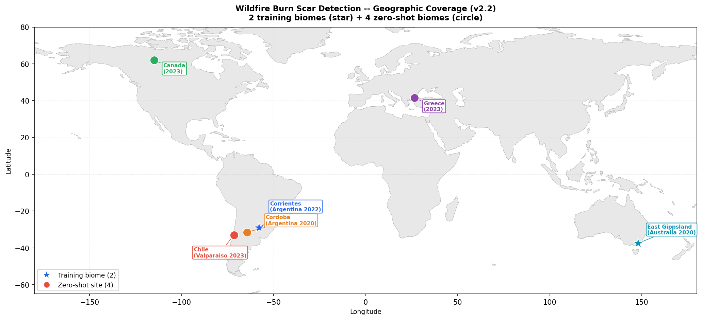
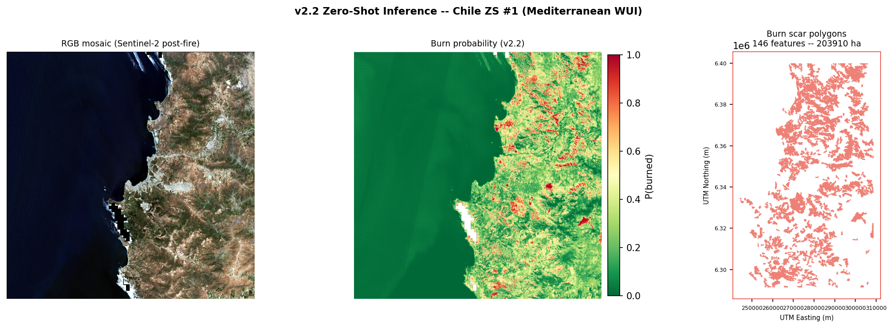
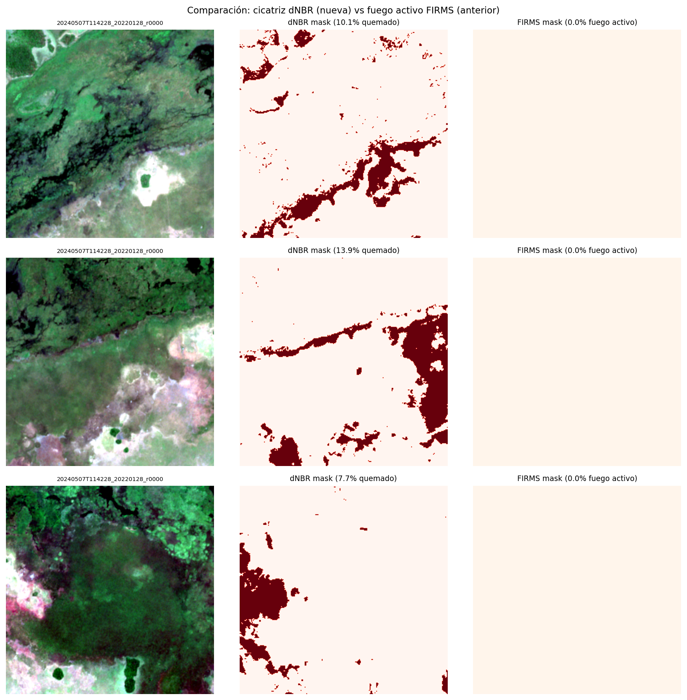

# Wildfire Burn Scar Detection -- Prithvi-EO Foundation Models and Sentinel-2

[](https://aacunapintos.github.io/wildfire-burn-scar-detection/) [](#license)

Zero-shot cross-biome burn scar segmentation using IBM/NASA geospatial foundation models on Sentinel-2 L2A imagery. Trained on two fire events on two continents, the model generates GIS-ready burn scar polygons on wildfires it has never seen, with no target-domain annotations.

**[Explore the live interactive demo](https://aacunapintos.github.io/wildfire-burn-scar-detection/)** -- click any detected polygon on the Valparaiso, Chile 2023 wildfire for its burn probability, confidence level, area, and perimeter.



*Training sites (Corrientes, Argentina, subtropical savanna, and East Gippsland, Australia, temperate forest) and all four zero-shot evaluation sites to date: Cordoba (Argentine Monte), Greece (Mediterranean shrubland), Canada (boreal forest), and the current showcase, Valparaiso, Chile (Mediterranean wildland-urban interface). Per-site metrics for Cordoba, Greece, and Canada are in the version history below; Chile's interactive results are on the live dashboard.*

The current model (v2.2, Prithvi-EO-2.0-300M) reaches IoU=0.6512 on held-out validation data and was applied without retraining to the February 2023 Valparaiso wildfires, one of the deadliest fire episodes in Chile's modern history. It detected 146 burn scar zones covering 203,910 ha, exported as a GIS-ready GeoPackage and shown on the interactive dashboard above.

---

## Key Results

**49x improvement over the FIRMS-based baseline**: pixel-level IoU went from 0.013 (naive active-fire labels) to 0.6512 (dNBR labels + Prithvi-EO-2.0-300M, threshold-tuned) on held-out validation data.

The model has since been evaluated zero-shot (no target-domain annotations) across 4 biomes on 3 continents: Argentine Monte scrubland, Mediterranean shrubland, boreal forest, and now Mediterranean wildland-urban interface (Chile, current showcase below). AUC-ROC exceeded 0.5 in every zero-shot biome tested to date.

Full per-version metrics, tables, and figures: **[CHANGELOG.md](CHANGELOG.md)**.

---

## v2.2 Highlights

- Live interactive dashboard (Leaflet + GeoJSON, hosted on GitHub Pages): click any polygon for its burn probability, confidence tier, area, and perimeter, with a toggle between probability-based and area-based coloring
- Applied zero-shot to the February 2023 Valparaiso wildfires (Chile), one of the deadliest fire episodes in Chile's modern history, affecting wildland-urban interface areas near Vina del Mar
- 146 burn scar polygons detected, 203,910 ha total, mean burn probability 0.44 per polygon (range 0.31-0.69)
- Per-polygon confidence tiering (HIGH / MEDIUM / LOW) based on mean burn probability, flagging likely false positives for manual review instead of presenting every detection as equally reliable
- Second training biome (East Gippsland, Australia, temperate forest) added alongside Corrientes before this round of zero-shot evaluation



*Valparaiso, Chile zero-shot detection: RGB mosaic (post-fire Sentinel-2), burn probability map, and vectorized burn scar polygons. 146 zones, 203,910 ha total, decision threshold=0.450.*

Quantitative zero-shot metrics (IoU, AUC-ROC) for Chile are pending a dNBR reference computation and are not yet available; v2.2 reports descriptive detection statistics only (polygon count, area, mean probability). See Limitations.

---

## Approach

### The label problem

Initial training used NASA FIRMS active fire detections as ground truth. Only 2.6% of patches contained fire pixels, producing a pixel-level IoU of 0.013. The validation metric appeared higher (0.50) because empty patches scored 1.0 trivially, inflating the per-batch average.

FIRMS detects active fire (thermal anomaly), not burn scars. A pixel that burned three days ago leaves no thermal signal but remains a burned area. The correct label source is dNBR (differenced Normalized Burn Ratio), computed from pre- and post-fire Sentinel-2 imagery.

```
dNBR = NBR_pre - NBR_post     where NBR = (B8A - B12) / (B8A + B12)
Burn scar threshold: dNBR > 0.10
```

This change increased positive patch coverage from 2.6% to 55.8% (21x more training signal) and enabled meaningful learning.



*Each row shows one patch: RGB image (left), dNBR burn scar mask (center, threshold dNBR > 0.10), and FIRMS active fire mask (right). dNBR captures the complete burned area; FIRMS misses it because the thermal signal disappears days after burning.*

### Model architecture (current: v2.2, Prithvi-EO-2.0-300M)

| Component | Details |
|---|---|
| Backbone | Prithvi-EO-2.0-300M (IBM/NASA), embed_dim=1024, depth=24, 307M parameters |
| Pretraining | Masked autoencoding on HLS multi-temporal (T=3) at global scale |
| Neck | MultiScaleNeck: layers 5, 11, 17, 23 (d_model=1024) to 256-ch feature map |
| Decoder | Feature Pyramid Network (FPN), 5-stage transposed convolutions, trained from scratch |
| Input bands | B02, B03, B04, B8A, B11, B12 (same 6 bands, T=1 post-fire) |
| Patch size | 224x224 px |
| Threshold | t=0.450 (optimized on Corrientes + Australia validation set) |
| Loss | DiceLoss + FocalLoss, fire class weight = 5.0 |

Earlier architecture (v1.x, Prithvi-EO-1.0-100M) is documented in [CHANGELOG.md](CHANGELOG.md#model-architecture-v1x-prithvi-eo-10-100m).

---

## Dataset

### Training: Corrientes, Argentina

| | |
|---|---|
| Region | Corrientes Province, NE Argentina (subtropical wetlands and grasslands) |
| Coordinates | 59.5W-56.0W / 29.0S-26.5S |
| Fire event | December 2021 - February 2022 (austral summer, extreme drought year) |
| Burned area | ~900,000 ha |
| Scenes | 6 Sentinel-2 L2A tiles, 0% cloud cover |
| Patches | 5,687 x 224x224 px |
| Positive rate | 55.8% (dNBR > 0.10) |
| Source | Copernicus Data Space Ecosystem (CDSE) |

### Training: East Gippsland, Australia

| | |
|---|---|
| Region | East Gippsland, Victoria, Australia (temperate eucalyptus forest) |
| Coordinates | 146.5E-150.0E / 39.0S-36.5S |
| Fire event | Black Summer 2019-2020 (pre-fire Jul-Aug 2019, post-fire Feb-Mar 2020) |
| Scenes | 18 Sentinel-2 L2A tiles |
| Patches | 6,000 x 224x224 px (subsampled from 48,664 extracted) |
| Source | Copernicus Data Space Ecosystem (CDSE) |

Earlier zero-shot test sites (Cordoba, Greece, Canada) are documented in [CHANGELOG.md](CHANGELOG.md#dataset-earlier-zero-shot-sites-v1x-v21).

### Zero-shot showcase: Valparaiso, Chile (v2.2)

| | |
|---|---|
| Region | Valparaiso Region, Central Chile |
| Coordinates | 71.8W-71.0W / 33.5S-32.5S |
| Fire event | February 2023 (one of the deadliest wildfire episodes in Chile's modern history) |
| Biome | Mediterranean wildland-urban interface |
| Patches | 6,988 x 256x256 px (most-burned tile, stride=128) |
| Detected | 146 polygons, 203,910 ha, mean burn probability 0.44 |
| Labels used in training | None |

---

## Results

Detailed per-version results (Corrientes validation curves, threshold optimization, T=2 temporal fusion ablation, Cordoba few-shot fine-tuning, Greece and Canada zero-shot breakdowns, operational decision support) are in [CHANGELOG.md](CHANGELOG.md#detailed-results). Below: the current showcase.

### Vector output: Chile 2023 (v2.2)


*Chile ZS: RGB mosaic (post-fire Sentinel-2), burn probability map, and vector polygon perimeters in UTM zone 19S, Valparaiso Region.*

| Site | Polygons | Detected area | Mean burn probability |
|---|---|---|---|
| Chile ZS (v2.2) | 146 | 203,910 ha | 0.44 (range 0.31-0.69) |

GeoPackage attributes: `area_ha`, `perimeter_km`, `site`, `date`, `model`, `mean_prob`. Explore results interactively on the [live dashboard](https://aacunapintos.github.io/wildfire-burn-scar-detection/): each polygon shows its burn probability, confidence tier (HIGH / MEDIUM / LOW), area, and perimeter on click.

---

## Limitations

**Biome-induced domain shift.** The FPN decoder was trained on a single biome (Corrientes wetlands). Recall drops significantly in unseen biomes (0.21 in Canada vs 0.81 in Corrientes T=2), meaning the model misses a large fraction of burned area at zero-shot. Precision remains useful (0.68 in Canada): patches flagged as burned are reliable, but the model is conservative.

**Single temporal input in v2.0.** The v2.0 model uses T=1 (post-fire image only). The v1.6 Siamese model demonstrated that adding a pre-fire temporal input raises IoU by +18.6% on Corrientes. Extending v2.0 to T=3 (as Prithvi-EO-2.0 was pretrained) is the highest-impact architectural improvement.

**ViT tiling artifact.** Predictions show 16x16 pixel block artifacts inherited from the ViT patch tokenizer. Gaussian smoothing (sigma=3) reduces the artifact in uncertainty maps; the effect on binary IoU is minor.

**Patch extraction gap.** Patches are extracted at stride=256 with center crop T=16, leaving 32-pixel (320m) gaps between adjacent patch predictions. Vector perimeters carry a boundary uncertainty of approximately 160m and area estimates may differ from true burned extent by 15-25% depending on polygon size. Overlapping extraction (stride less than 256) would eliminate this artifact but requires re-downloading the original Sentinel-2 imagery.

**Water and nodata contamination.** NWT contains large lakes and rivers that produce false positives. A post-processing NDWI filter (applied during evaluation) partially mitigates this; morphological post-processing would further improve precision.

**Chile quantitative validation pending.** Unlike Cordoba, Greece, and Canada, IoU and AUC-ROC for the Chile zero-shot detection are not yet available. The dNBR reference raster and the model's probability raster are currently computed on slightly different pixel grids, and require alignment before per-polygon scoring is reliable. Only descriptive detection statistics (polygon count, area, mean probability) are reported for v2.2 until this is resolved.

---

## Roadmap

| Priority | Improvement | Expected gain | Status |
|---|---|---|---|
| 1 | Second training biome (Mediterranean 2021 or boreal 2019) | +10-20 IoU ZS | **Done (v2.2, Australia)** |
| 2 | Multi-temporal input T=3 (matching Prithvi-EO-2.0 pretraining) | +5-10 IoU | Planned (v3.0) |
| 3 | Test-Time Augmentation (flip H/V average) | +2-5 IoU | Planned |
| 4 | Vector output (GeoPackage burn scar polygons + NDVI) | Operational | **Done (v2.1)** |
| 5 | FastAPI inference endpoint (coordinates + date to mask) | Deployment | Planned (MLOps) |
| 6 | Morphological post-processing (remove isolated pixels) | Precision | Planned |
| 7 | Interactive Leaflet dashboard (GitHub Pages) | Portfolio / interpretability | **Done (v2.2)** |
| 8 | Chile dNBR ground truth alignment + quantitative ZS metrics | Validation | Planned |
| 9 | California and Cerrado (Brazil) zero-shot sites | Cross-biome coverage | Planned (v2.3) |
| 10 | ESA WorldCover land cover context per polygon | Interpretability | Planned |

---

## Changelog

| Version | Change | Val IoU | Notes |
|---|---|---|---|
| v1.0 | Base model, FIRMS labels, threshold=0.50 | 0.013 | Prithvi-EO-1.0-100M + FPN |
| v1.1 | Switch to dNBR labels (threshold=0.10) | 0.42 | 21x more positive patches. 49x IoU improvement vs v1.0 |
| v1.2 | Optimal threshold t=0.65, continuation training | 0.45 | Post-processing only for threshold. Epoch 73 best checkpoint |
| v1.3 | Partial backbone unfreeze (last 2 transformer blocks) | 0.50 | Differential LR (1e-5 backbone, 5e-5 decoder) |
| v1.4 | Spectral variation training (contrast, brightness, noise) | 0.36 | Too aggressive late in training. v1.3 checkpoint preserved |
| v1.5 | Multi-scale FPN neck (layers 2, 5, 8, 11) | 0.538 | 45 epochs. IoU +8.9% vs v1.3. ZS Cordoba: IoU=0.115, AUC-ROC=0.738 |
| v1.6 | Siamese T=2 temporal fusion (pre + post fire) | 0.639 | TemporalFusionNeck. IoU +18.6% vs v1.5. FT Cordoba T=2: IoU=0.810 |
| v1.7 | Cordoba geographic evaluation (ZS and few-shot FT, T=1 and T=2) | 0.538 | ZS: IoU=0.115 (T=1), 0.087 (T=2). FT: IoU=0.329 (T=1), 0.810 (T=2 within-region) |
| v1.8 | Cross-continental ZS evaluation on Greece 2023 (Alexandroupolis, Mediterranean) | 0.538 | ZS Greece: IoU=0.232, AUC-ROC=0.595. No Greek labels. 10,119 patches |
| **v2.0** | **Backbone upgrade to Prithvi-EO-2.0-300M (307M params, embed_dim=1024, depth=24)** | **0.532** | **New ZS site: Canada NWT 2023 (boreal forest, 163,000 ha). AUC-ROC > 0.5 confirmed in 3 biomes. MC Dropout operational decision support** |
| **v2.1** | **Vector output: burn scar perimeters as GeoPackage (GPKG) for 3 zero-shot sites** | **0.532** | **NDVI + NBR per scene. RGB mosaics. Georeferenced polygons (UTM) with area, perimeter, model attributes. Boundary uncertainty ~160m** |
| **v2.2** | **Second training biome (Australia); interactive Leaflet dashboard (GitHub Pages); zero-shot showcase on Chile 2023 (Valparaiso)** | **0.598** | **Threshold-tuned IoU=0.6512, F1=0.7887. 146 polygons, 203,910 ha, mean_prob per polygon, confidence tiering. California/Cerrado planned next** |

---

## Repository Structure

```
wildfire-spread/
+-- CHANGELOG.md                         Full version history: metrics, figures, detailed results
+-- docs/
|   +-- index.html                       Interactive Leaflet dashboard (GitHub Pages, data embedded inline)
+-- notebooks/
|   +-- 01_data_acquisition.ipynb        Sentinel-2 L2A (CDSE) + NASA FIRMS download
|   +-- 02_preprocessing.ipynb           Band stacking, patch extraction, dNBR labels
|   +-- 03_baseline.ipynb                U-Net ResNet34 training + diagnostic evaluation
|   +-- 04_prithvi_training.ipynb        Prithvi-EO-1.0-100M fine-tuning v1.0-v1.5 (Colab A100)
|   +-- 04b_prithvi_t2.ipynb             Siamese T=2 temporal fusion, v1.6 (Colab A100)
|   +-- 05_cordoba_data.ipynb            Cordoba test set acquisition and preprocessing
|   +-- 06_cordoba_evaluation.ipynb      Geographic generalization + few-shot adaptation (Colab A100)
|   +-- 07_inference_demo.ipynb          Single-patch inference demo (Colab)
|   +-- 08_prithvi_v2_training.ipynb     Prithvi-EO-2.0-300M fine-tuning v2.0 (Colab A100)
|   +-- 09_greece_zs_evaluation.ipynb    Cross-continental ZS evaluation on Greece 2023 (Colab A100)
|   +-- 10_canada_zs_evaluation.ipynb    ZS evaluation on Canada NWT 2023 + decision support (Colab A100)
|   +-- v2.2/
|       +-- 15_train_v22.ipynb           Training (Corrientes + Australia) + Chile ZS (Colab A100)
+-- results/
|   +-- world_map_v22.png                Geographic overview: 2 training sites + Chile ZS (v2.2)
|   +-- chile_vector_output_v22.png      Chile v2.2: RGB mosaic, probability, vector polygons
|   +-- cross_site_vector_summary_v22.png  Zero-shot vector summary (v2.2)
|   +-- threshold_sweep_v22.png          Metrics vs threshold + PR curve (v2.2)
|   +-- validation_overview_v22.png      Corrientes + Australia validation overview (v2.2)
|   +-- canada_cross_biome_summary_v2.png  Cross-biome IoU and AUC-ROC comparison (v2.0, 4 sites)
|   +-- canada_decision_support_v2.png   Operational decision support (DEPLOY/VERIFY/MONITOR)
|   +-- cordoba_vector_output_v21.png   Cordoba v2.1: RGB mosaic, probability, NDVI, vector polygons
|   +-- greece_vector_output_v21.png    Greece v2.1: RGB mosaic, probability, NDVI, vector polygons
|   +-- canada_vector_output_v21.png    Canada v2.1: RGB mosaic, probability, NDVI, vector polygons
|   +-- cross_site_vector_summary_v21.png  Cross-site burn scar perimeters as UTM vector polygons (v2.1)
|   +-- canada_zs_best_v2.png            Canada ZS: best predictions
|   +-- canada_zs_curves.png             Canada ZS: PR and ROC curves
|   +-- validation_overview.png          Corrientes: best/median/worst patches, v1.0 to v1.6 progression
|   +-- validation_overview_t2.png       Corrientes T=2: detailed patch grid and training curves
|   +-- threshold_sweep.png              Metrics vs threshold + PR curve (v1.1)
|   +-- dnbr_vs_firms_comparison.png     dNBR vs FIRMS label comparison
|   +-- cordoba_predictions.png          Cordoba v1.5 zero-shot: best patches
|   +-- cordoba_evaluation_overview.png  All-in-one: model progression + Cordoba ZS/FT + T=2 delta
|   +-- cordoba_finetune_predictions.png Cordoba v1.5 few-shot FT: best patches
|   +-- greece_cross_biome_summary.png   Cross-biome IoU and AUC-ROC comparison (v1.x)
|   +-- greece_zs_best.png               Greece 2023: best zero-shot predictions
|   +-- greece_zs_curves.png             Greece 2023: PR and ROC curves
+-- scripts/
|   +-- 00_prefire_download.py           Download pre-fire Sentinel-2 tiles for T=2 pairs
|   +-- 03b_paired_patches.py            Build aligned pre/post patch pairs
|   +-- 09_greece_download.py            Download Sentinel-2 L2A for Alexandroupolis 2023
|   +-- 10_greece_patches.py             JP2 to GeoTIFF, dNBR, patch extraction (Greece)
|   +-- 11_canada_pipeline.py            Download + JP2 to GeoTIFF + dNBR + patches (Canada, combined)
|   +-- 15_chile_download.py             Download Sentinel-2 L2A for Valparaiso 2023
|   +-- 16_chile_patches.py              JP2 to GeoTIFF, dNBR, patch extraction (Chile)
|   +-- 17-20_california_cerrado_*.py    California and Cerrado download/patches (planned sites)
|   +-- 21_run_zs_pipeline.py            Orchestrates download + patch extraction for all ZS sites
+-- models/
|   +-- best_prithvi_v22_burn_scar_wildfire.pth  v2.2 checkpoint (Prithvi-EO-2.0-300M + FPN)
+-- environment.yml
+-- .gitignore
```

---

## Reproduce

**Environment**

```bash
conda env create -f environment.yml
conda activate geoai-wildfire
```

**Credentials**

Copy `.env.example` to `.env` and fill in:

```
CDSE_USER=your_copernicus_user
CDSE_PASSWORD=your_copernicus_password
FIRMS_API_KEY=your_firms_key
```

- CDSE: free account at [dataspace.copernicus.eu](https://dataspace.copernicus.eu)
- FIRMS: free API key at [firms.modaps.eosdis.nasa.gov](https://firms.modaps.eosdis.nasa.gov/api/area/)

**Run order**

Notebooks 01-03 and 05 run locally on CPU (4-5 hours total, mostly data download).
Notebooks 04, 04b, 06, 08, 09, 10, and v2.2/15 require a GPU (Google Colab A100 recommended).
Scripts 11 and 21 run locally for the Canada and Chile pipelines respectively (download + patch extraction, several hours each).

---

## Data Sources

| Dataset | Provider | Access |
|---|---|---|
| Sentinel-2 L2A | ESA / Copernicus Data Space Ecosystem (CDSE) | Free, registration required |
| VIIRS SNPP active fire | NASA FIRMS | Free, API key required |
| ERA5 reanalysis (fire weather) | Copernicus Climate Data Store (CDS) | Free, registration required |

---

## References

- Jakubik, J. et al. (2023). Foundation Models for Generalist Geospatial Artificial Intelligence. arXiv:2310.18660
- Prithvi-EO-1.0-100M: [ibm-nasa-geospatial/Prithvi-EO-1.0-100M](https://huggingface.co/ibm-nasa-geospatial/Prithvi-EO-1.0-100M)
- Prithvi-EO-2.0-300M: [ibm-nasa-geospatial/Prithvi-EO-2.0-300M](https://huggingface.co/ibm-nasa-geospatial/Prithvi-EO-2.0-300M)
- Key, C.H. and Benson, N.C. (2006). Landscape Assessment: Ground measure of severity. USDA Forest Service
- terratorch: [github.com/IBM/terratorch](https://github.com/IBM/terratorch)

---

## License

MIT
